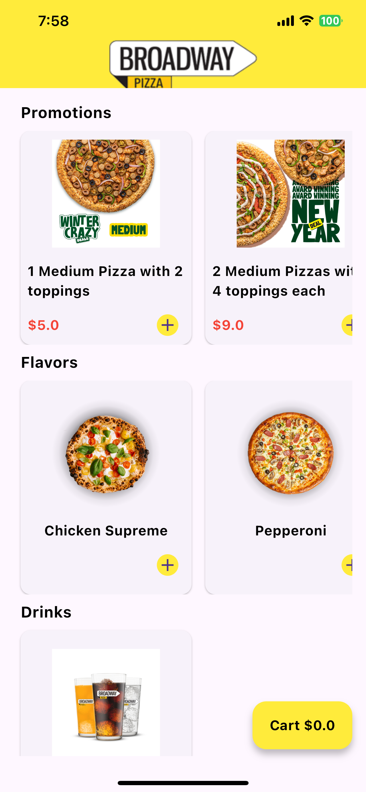
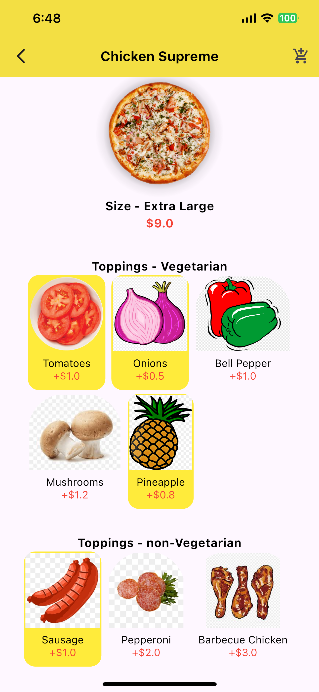
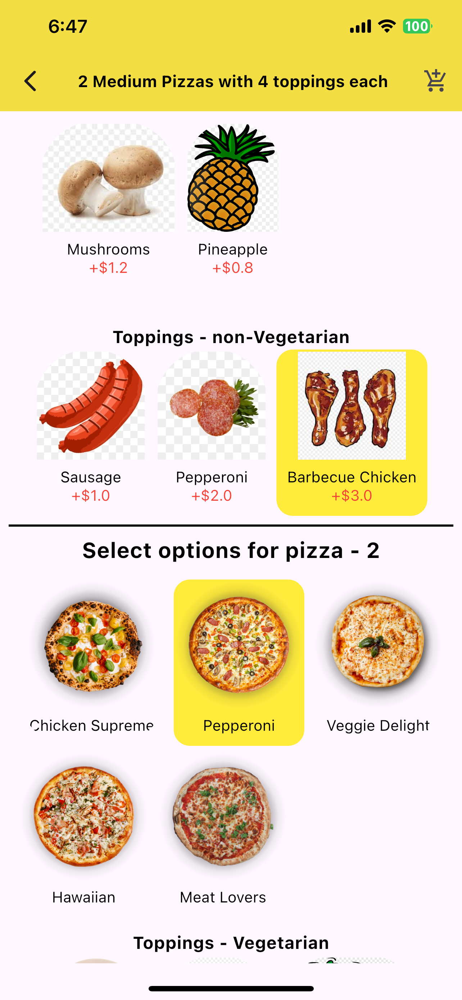
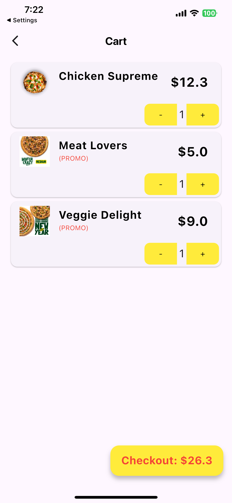

# Flutter Pizza Store

A Flutter application demonstrating dynamic loading and calculations for a pizza store. The project uses **GetX** for state management and leverages JSON files to simulate incoming server data.

## Description

This application is a simplified pizza store with dynamic functionality, including loading menu details and calculating user selections. It simulates server data using two JSON files:
- `menu.json`: Contains information about the menu, including flavors, promotions, and drinks.
- `details.json`: Provides additional details for dynamic selection.

The app includes three screens to provide a seamless user experience:
1. **Home Screen**: Displays all available flavors, promotions, and drinks.
2. **Selection Screen**: Allows users to dynamically select pizza flavors, sizes, and toppings for individual pizzas or promotional combos.
3. **Cart Screen**: Shows the cart contents and enables users to adjust item quantities.

The current implementation of the checkout feature clears the cart and displays a confirmation via a Snackbar.

**Landscape mode is also available**

## Constraints

1. **Cart Screen** Can only add 10 items of same flavor at max.
2. **Selection Screen** Topping for flavors can all selected while for promo, toppings selection is constrained based on the max toppings allowed to be added in cart.
3. **Selection Screen** For 3rd Offer, I am multiplying by 0.5 to make the 50% discount

## Screenshots
### Home Screen


### Selection Screen



### Cart Screen


## Features
- Dynamic menu loading using JSON files.
- State management using GetX.
- Interactive screens:
    - **Home Screen**: Browse available items.
    - **Selection Screen**: Customize pizzas dynamically.
    - **Cart Screen**: View and adjust cart items.
- Simple checkout functionality (clears the cart and shows a Snackbar).


### VIDEO AND APK
- Android Apk is present in **Android_apk** folder
- App video is present in **Video** folder

## Getting Started

### Prerequisites
- Flutter SDK: [Install Flutter](https://flutter.dev/docs/get-started/install)

### Installation
1. Clone the repository:
   ```bash
   git clone https://github.com/your-username/flutter-pizza-store.git
